

<!-- Package utilisée pour la création de ce document: library(rmarkdown), library(prettydoc)--> 

<h2>  **Formation "Prise en main du OneDrive M365" (Octobre 2023)** </h2> 

------------------

<h3> **Objectifs de la formation** :</h3>

Cette formation de 2h à pour vocation de vous faire découvrir la toute dernière version de Microsoft Office (renommée "Microsoft 365") et plus particulièrement une partie de ses services Cloud associés.

Durée de la formation : 1h30 +/- 30 minutes selon les questions
Pré-requis : Windows 10 ou 11 & M365 d'installé sur son PC

------------------

**Introduction générale** 

# **1. Distinction entre OneDrive salarié et OneDrive CEN-NA (ou "serveur CEN-NA")**

## OneDrive salarié 
Connectez-vous à [conservatoirena-my.sharepoint.com](conservatoirena-my.sharepoint.com) à l'aide de votre adresse @cen-na.org et le mot de passe que vous avez défini au moment de l'installation de M365.

Cliquez ensuite sur l'onglet "Mes fichiers" dans l'encart en haut à gauche de votre écran pour accéder à la racine de votre OneDrive salarié comme affiché ci-dessous:

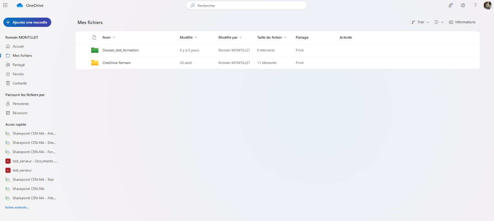

<u>Pour rappel </u>:

* Chaque salarié dispose dans son OneDrive attitré d'un espace de stockage de 1To (limite maximum de stockage possible).
* Les éléments de travail stockés dans ce OneDrive salarié sont visibles par défaut uniquement au salarié associé.
* Le salarié est l'unique responsable de la gestion des fichiers stockés dans son OneDrive. La DSI n'a pas la main pour restaurer d'éventuels fichiers supprimés si ces derniers n'ont pas été récupérés dans la corbeille du OneDrive salarié au terme d'un délai de 30 jours
    
## OneDrive CEN-NA

Le OneDrive CEN-NA correspond à un type de OneDrive (OneDrive Entreprise) spécialement conçu pour les structures dont l'un des objectifs principales est de faciliter le travail collaboratif et le partage de fichiers au sein des équipes.
Contrairement au OneDrive salarié, la stratégie de contrôle d’accès aux dossiers du OneDrive CEN-NA est gérée par la DSI ainsi que les niveaux des modalités de partage afin de garantir la sécurité de nos données. Chaque salarié du CEN-NA a ainsi, en fonction de son appartenance à des groupes de sécurité (CSE / CODIR / Services etc.), automatiquement accès aux dossiers de travail du CEN-NA qui lui sont accessibles.

Tout comme pour le OneDrive salarié, il est possible d'accéder au OneDrive CEN-NA depuis votre navigateur internet. Néanmoins, le OneDrive CEN-NA étant en réalité un agglomérat de plusieurs OneDrive il n'est pas accessible via une url unique mais via 7 url pointant vers les dossiers parents de l'arborescence de ce serveur CEN-NA:

 &nbsp; [00_Ressources](https://conservatoirena-my.sharepoint.com/personal/medias_cen-na_org/_layouts/15/onedrive.aspx?csf=1&web=1&cid=9fb7155e%2D3ce7%2D44fa%2Da39c%2D0ae8ef1e1dd1&id=%2Fpersonal%2Fmedias%5Fcen%2Dna%5Forg%2FDocuments%2F00%5FRessources&FolderCTID=0x012000EE6CF94A57AC2C47B7F26258FA694D92&view=0)

 &nbsp; [01_Vie_Interne](https://conservatoirena-my.sharepoint.com/personal/cen_conservatoirena_onmicrosoft_com/_layouts/15/onedrive.aspx?csf=1&web=1&cid=643cd14f%2Dcc2f%2D4783%2Da577%2Dfc5e6845f292&id=%2Fpersonal%2Fcen%5Fconservatoirena%5Fonmicrosoft%5Fcom%2FDocuments%2F01%5FVie%5Finterne&FolderCTID=0x0120004CC4BD33D11F764EB1D59C49373A0295&view=0)

 &nbsp; [02_Services](https://conservatoirena-my.sharepoint.com/personal/services_conservatoirena_onmicrosoft_com/_layouts/15/onedrive.aspx?csf=1&web=1&cid=e8647535%2D193d%2D4311%2D99a0%2D2cda112c9755&id=%2Fpersonal%2Fservices%5Fconservatoirena%5Fonmicrosoft%5Fcom%2FDocuments%2F02%5FServices&FolderCTID=0x0120004CC4BD33D11F764EB1D59C49373A0295&view=0)

 &nbsp; [03_Antennes_Billere](https://conservatoirena-my.sharepoint.com/personal/billere_conservatoirena_onmicrosoft_com/_layouts/15/onedrive.aspx?csf=1&web=1&cid=0076b766%2Dd198%2D451b%2Db478%2D8f78a8f130d5&id=%2Fpersonal%2Fbillere%5Fconservatoirena%5Fonmicrosoft%5Fcom%2FDocuments%2F03%5FAntennes%5FBillere&FolderCTID=0x0120004CC4BD33D11F764EB1D59C49373A0295&view=0)

 &nbsp; [04_Antennes_Poitiers](https://conservatoirena-my.sharepoint.com/personal/poitiers_conservatoirena_onmicrosoft_com/_layouts/15/onedrive.aspx?csf=1&web=1&cid=c162f77f%2D3177%2D4de5%2D8347%2D58f52a8b18a8&id=%2Fpersonal%2Fpoitiers%5Fconservatoirena%5Fonmicrosoft%5Fcom%2FDocuments%2F04%5FAntennes%5FPoitiers&FolderCTID=0x0120004CC4BD33D11F764EB1D59C49373A0295&view=0)

 &nbsp; [05_Antennes_Saint-Gence](https://conservatoirena-my.sharepoint.com/personal/saintgence_conservatoirena_onmicrosoft_com/_layouts/15/onedrive.aspx?csf=1&web=1&cid=bad579b2%2D4aaf%2D4f56%2D8909%2D3465c2d70fe2&id=%2Fpersonal%2Fsaintgence%5Fconservatoirena%5Fonmicrosoft%5Fcom%2FDocuments%2F05%5FAntennes%5FSaint%2DGence&FolderCTID=0x0120004CC4BD33D11F764EB1D59C49373A0295&view=0)

 &nbsp; [06_Archives](https://conservatoirena-my.sharepoint.com/personal/archives_cen-na_org/_layouts/15/onedrive.aspx?csf=1&web=1&cid=fce8e1a1%2D0871%2D4e2d%2D9a92%2De0a202e0759b&id=%2Fpersonal%2Farchives%5Fcen%2Dna%5Forg%2FDocuments%2F06%5FArchives&FolderCTID=0x012000EE6CF94A57AC2C47B7F26258FA694D92&view=0)

 &nbsp; [07_Dossiers_transversaux](https://conservatoirena-my.sharepoint.com/personal/cen_conservatoirena_onmicrosoft_com/_layouts/15/onedrive.aspx?id=%2Fpersonal%2Fcen%5Fconservatoirena%5Fonmicrosoft%5Fcom%2FDocuments%2F07%5FDossiers%5Ftransversaux&FolderCTID=0x0120004CC4BD33D11F764EB1D59C49373A0295&view=0)

## Synchronisation du OneDrive CEN-NA à l'explorateur de fichiers Windows

Aussi pour faciliter l'accès au Serveur CEN-NA et afin de pouvoir accéder à l'aborescence de dossiers associée depuis un même endroit, il est possible de synchroniser tout le OneDrive CEN-NA dans son explorateur de fichiers Windows en suivant les étapes suivantes:

1. Ouvrir l'application OneDrive sur votre ordinateur : 

 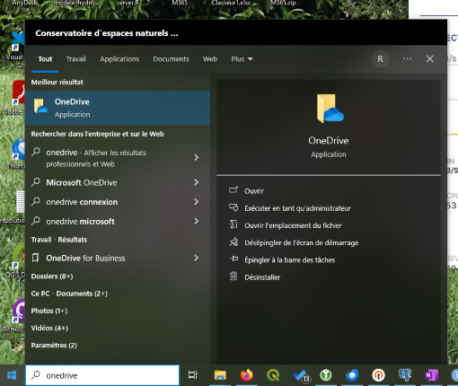 

2. S'y connecter avec votre identifiant @cen-na.org et votre mot de passe

 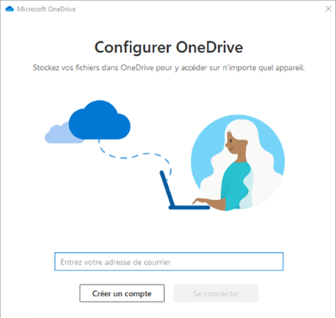 

3. Ne sauvegardez pas vos dossiers de votre ordinateur avec le OneDrive si vous n'avez pas plusieurs dizaines de Go de libres sur le disque dur de votre PC. (Cliquez dans ce cas sur "Je le ferai plus tard" situé en bas à gauche de la fenêtre)

 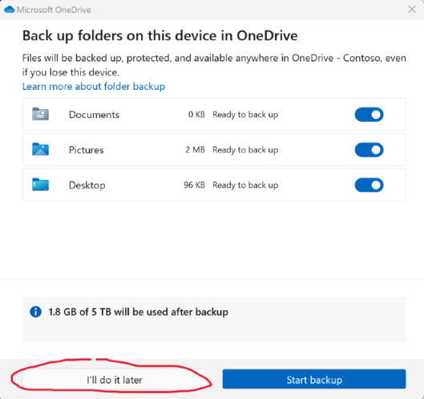 

4. Une fois connecté, votre OneDrive et son contenu doit s'afficher dans votre explorateur de fichiers :

 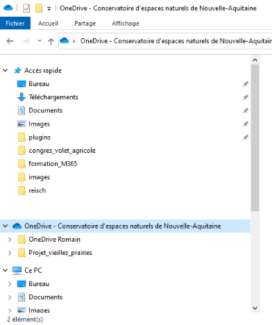 

5. En plus du OneDrive salarié nous allons maintenant pouvoir ajouter le OneDrive CEN-NA à l'explorateur de fichiers.
Il vous suffit pour chaque dossier parent de l'arborescence serveur ([00_Ressources](https://conservatoirena-my.sharepoint.com/personal/medias_cen-na_org/_layouts/15/onedrive.aspx?csf=1&web=1&cid=9fb7155e%2D3ce7%2D44fa%2Da39c%2D0ae8ef1e1dd1&id=%2Fpersonal%2Fmedias%5Fcen%2Dna%5Forg%2FDocuments%2F00%5FRessources&FolderCTID=0x012000EE6CF94A57AC2C47B7F26258FA694D92&view=0) / [01_Vie_Interne](https://conservatoirena-my.sharepoint.com/personal/cen_conservatoirena_onmicrosoft_com/_layouts/15/onedrive.aspx?csf=1&web=1&cid=643cd14f%2Dcc2f%2D4783%2Da577%2Dfc5e6845f292&id=%2Fpersonal%2Fcen%5Fconservatoirena%5Fonmicrosoft%5Fcom%2FDocuments%2F01%5FVie%5Finterne&FolderCTID=0x0120004CC4BD33D11F764EB1D59C49373A0295&view=0) / [02_Services](https://conservatoirena-my.sharepoint.com/personal/services_conservatoirena_onmicrosoft_com/_layouts/15/onedrive.aspx?csf=1&web=1&cid=e8647535%2D193d%2D4311%2D99a0%2D2cda112c9755&id=%2Fpersonal%2Fservices%5Fconservatoirena%5Fonmicrosoft%5Fcom%2FDocuments%2F02%5FServices&FolderCTID=0x0120004CC4BD33D11F764EB1D59C49373A0295&view=0) / [03_Antennes_Billere](https://conservatoirena-my.sharepoint.com/personal/billere_conservatoirena_onmicrosoft_com/_layouts/15/onedrive.aspx?csf=1&web=1&cid=0076b766%2Dd198%2D451b%2Db478%2D8f78a8f130d5&id=%2Fpersonal%2Fbillere%5Fconservatoirena%5Fonmicrosoft%5Fcom%2FDocuments%2F03%5FAntennes%5FBillere&FolderCTID=0x0120004CC4BD33D11F764EB1D59C49373A0295&view=0) / [04_Antennes_Poitiers](https://conservatoirena-my.sharepoint.com/personal/poitiers_conservatoirena_onmicrosoft_com/_layouts/15/onedrive.aspx?csf=1&web=1&cid=c162f77f%2D3177%2D4de5%2D8347%2D58f52a8b18a8&id=%2Fpersonal%2Fpoitiers%5Fconservatoirena%5Fonmicrosoft%5Fcom%2FDocuments%2F04%5FAntennes%5FPoitiers&FolderCTID=0x0120004CC4BD33D11F764EB1D59C49373A0295&view=0) / [05_Antennes_Saint-Gence](https://conservatoirena-my.sharepoint.com/personal/saintgence_conservatoirena_onmicrosoft_com/_layouts/15/onedrive.aspx?csf=1&web=1&cid=bad579b2%2D4aaf%2D4f56%2D8909%2D3465c2d70fe2&id=%2Fpersonal%2Fsaintgence%5Fconservatoirena%5Fonmicrosoft%5Fcom%2FDocuments%2F05%5FAntennes%5FSaint%2DGence&FolderCTID=0x0120004CC4BD33D11F764EB1D59C49373A0295&view=0) / [06_Archives](https://conservatoirena-my.sharepoint.com/personal/archives_cen-na_org/_layouts/15/onedrive.aspx?csf=1&web=1&cid=fce8e1a1%2D0871%2D4e2d%2D9a92%2De0a202e0759b&id=%2Fpersonal%2Farchives%5Fcen%2Dna%5Forg%2FDocuments%2F06%5FArchives&FolderCTID=0x012000EE6CF94A57AC2C47B7F26258FA694D92&view=0) / [07_Dossiers_transversaux](https://conservatoirena-my.sharepoint.com/personal/cen_conservatoirena_onmicrosoft_com/_layouts/15/onedrive.aspx?id=%2Fpersonal%2Fcen%5Fconservatoirena%5Fonmicrosoft%5Fcom%2FDocuments%2F07%5FDossiers%5Ftransversaux&FolderCTID=0x0120004CC4BD33D11F764EB1D59C49373A0295&view=0)) de cliquer sur le bouton "Synchroniser" pour voir ce dossier épinglé à votre explorateur de fichier.

 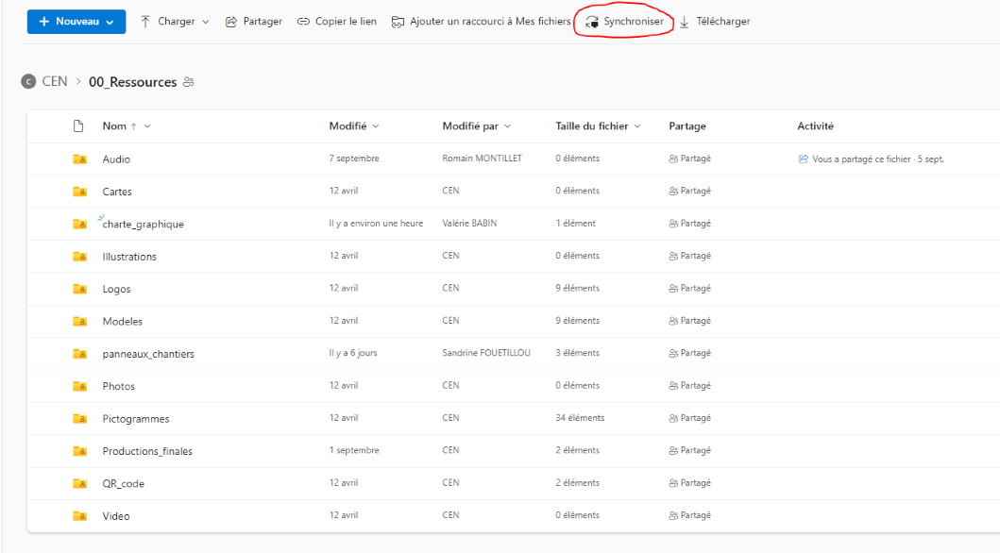 

*Exemple pour le dossier 00_Ressources*
 

6. Le OneDrive CEN-NA matérialisé par une icône d'immeuble bleu devrait apparaître dans votre explorateur de fichier avec le dossier CEN - 00_Ressources. 

 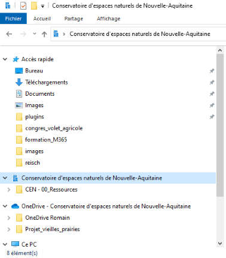 

7. Répetez l'opération pour les 6 autres dossiers. L'intégralité de l'arborescence serveur CEN-NA est désormais accessible depuis votre explorateur de fichiers :

 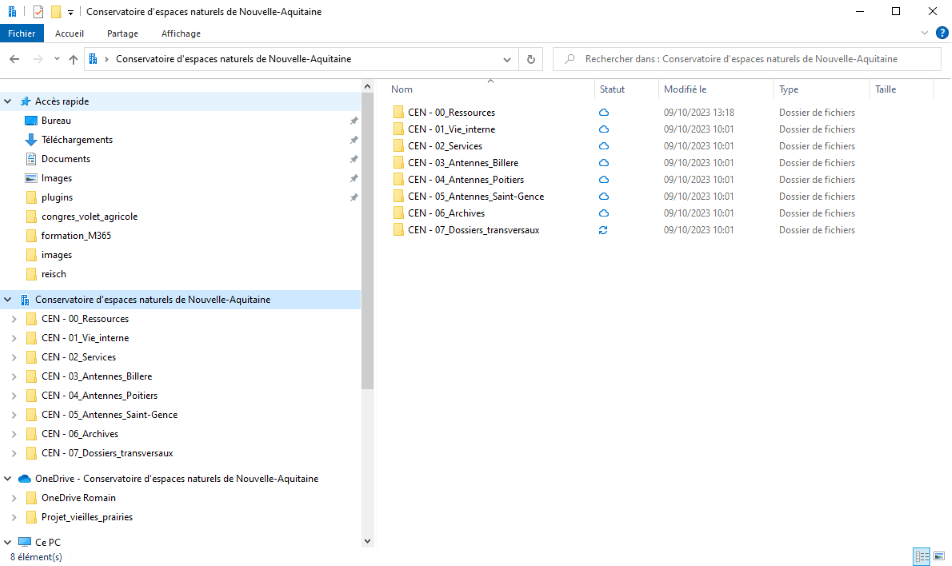 

## Utilisation ponctuelle du OneDrive CEN-NA et/ou du OneDrive salarié en mode "hors-connexion"

### Rendre des fichiers OneDrive mobilisables sans connexion internet

Un des avantages principaux de cette synchronisation du OneDrive avec l'explorateur de fichiers est qu'il peut être utilisé même sans connexion internet. Il en effet possible de travailler sur vos fichiers en étant hors ligne dès lors que le ou les fichiers en question présentent l'une des deux icônes suivantes:  / .[^1]

[^1]: Les fichiers dans l'explorateur de fichiers présentant l'icône:  correspondent aux fichiers que vous avez déjà ouverts sur votre ordinateur, ces derniers sont donc à la fois accessibles en ligne mais aussi en local, vous pouvez donc les ouvrir même sans connexion internet (ces derniers deviendront automatiquement de nouveau disponibles uniquement en ligne après le délai établi dans vos paramétrages dans l'assistant de stockage).  
Les fichiers présentant l'icône  correspondent aux fichiers pour lesquels l'option "Toujours conserver sur cet appareil" a été activée; tout comme les fichiers précédents ces fichiers restent accessibles en ligne mais également en local sur votre ordinateur. 

Pour activer cette fonctionnalité il suffit de faire un clic droit sur le ou les éléments souhaités (fichier(s) ou dossier(s)) et de sélectionner "Toujours conserver sur cet appareil".
Cette fonctionnalité peut ainsi permettre d'anticiper des sessions de travail sans connexion internet (déplacement en train par exemple), il vous suffit en effet d'activer cette option sur les fichiers souhaités avant de perdre votre connexion internet pour continuer à travailler dessus en étant hors ligne. Ainsi lorsque vous ajouterez, modifierez ou supprimerez des éléments d'un fichier ou d'un dossier dans votre OneDrive ou le OneDrive CEN-NA en étant hors-ligne, les modifications que vous ou d’autres personnes auront apportées seront synchronisées et appliquées automatiquement lorsque vous retrouverez une connexion à internet.

### Libérer de l'espace disque en repassant les fichiers OneDrive comme "accessible en ligne uniquement"

La fonctionnalité que nous venons de voir précedemment implique forcément une consommation de l'espace de stockage du disque dur de votre PC puisque vous téléchargez localement une copie des fichiers/dossiers du OneDrive sur lesquels vous souhaitez travailler en mode "hors-connexion". Il est donc important de n'utiliser cette fonctionnalité que sur des éléments ne représentant pas un trop gros volume de données. 
Une fois le travail "hors-connexion" terminé il est également recommandé de rendre de nouveau ces élements accessibles uniquement en ligne de manière à libérer de l'espace sur votre ordinateur.
Pour se faire, la démarche à suivre est très simple: il vous suffit de faire un clic-droit sur les fichiers présentant l'icône  et de sélectionner "Libérer de l'espace" pour désactiver la possibilité d'accéder à ces fichiers sans connexion internet et ainsi libérer de l'espace sur votre disquer dur. 

Vous pouvez également faire cela pour l'intégralité des fichiers et dossiers du OneDrive vous en cliquant sur l'icône en forme de nuage bleu dans la partie la plus à droite de la barre des tâches (à proximité de l'heure) et cliquer sur l'icône en forme de rouage et de sélectionner "paramètres": 

Cliquez ensuite sur "Paramètres avancés" :

Puis "Libérer de l'espace" :

Une fois l'opération terminée, l'explorateur de fichiers ouvrira une nouvelle fenêtre de votre OneDrive. Quelques instants plus tard l'intégralité de vos fichiers sera de nouveau accessible depuis l'explorateur de fichiers mais exclusivement sous réserve d'une connexion internet.

 

</i>

## Création/suppression de fichiers/dossiers dans le OneDrive

### Création d'un fichier dans mon OneDrive salarié depuis un navigateur web

Accédez à votre OneDrive salarié depuis votre naviguateur web et cliquez sur le bouton "Ajouter une nouvelle" pour créer un nouveau dossier ou fichier ou pour télécharger un fichier depuis votre ordinateur sur votre OneDrive salarié.

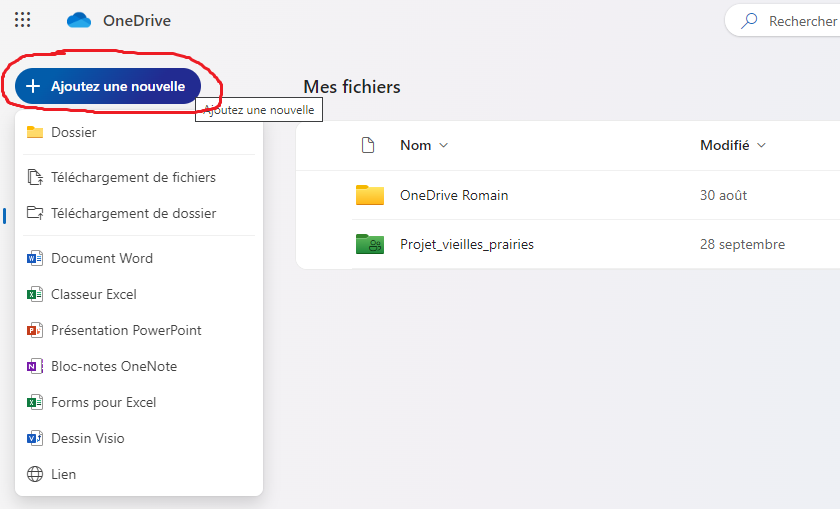

### Création d'un fichier dans mon OneDrive depuis l'explorateur de fichier

<u>Deux solutions </u>:

1. Clic-droit dans le dossier dans lequel vous souhaitez créer votre dossier et/ou votre fichier, puis sélectionnez "Nouveau" pour créer l'élément souhaité:

2. Ouvrez Word, Excel ou Powerpoint sur votre PC puis cliquez sur fichier "Enregistrer sous" et sélectionnez l'emplacement de votre OneDrive salarié ou du OneDrive CEN-NA pour y enregistrer l'élément.

### Transfert d'un fichier depuis mon PC vers mon OneDrive par glisser/déposer

- à partir de l'explorateur de fichiers :

Pour déplacer un fichier depuis votre PC vers votre OneDrive salarié ou vers le OneDrive CEN-NA vous pouvez utiliser la fonctionnalité "copier/couper - coller" ou alors faire un simple glisser/déposer :

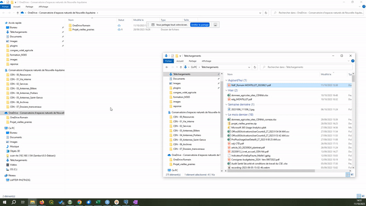

- à partir d'un navigateur web :

Vous pouvez également télécharger des fichiers ou des dossiers de votre PC vers votre OneDrive salarié ou vers le OneDrive CEN-NA directement depuis votre naviguateur web à partir du bouton "Ajouter une nouvelle" situé en haut à gauche de votre OneDrive : 

## Restauration d'un élément supprimé

### Cas du OneDrive salarié
Les fichiers supprimés des OneDrive salariés sont conservés dans les corbeilles OneDrive pendant 30 jours. Durant cette période, les fichiers peuvent être restaurés dans OneDrive, ou supprimés définitivement de votre espace OneDrive.

Remarque : Si votre corbeille est pleine, les éléments les plus anciens sont automatiquement supprimés au bout de trois jours.

Pour restaurer un élément depuis la corbeille du OneDrive salarié:

Allez dans votre OneDrive salarié / Cliquez sur "Corbeille" / Séléctionnez les éléments à restaurer / Cliquez sur "Restaurer" :

### Cas du OneDrive CEN-NA

Dans le cas d'une suppression d'un élément sur le OneDrive CEN-NA la restauration du ou des éléments en question devra se faire via un ticket destiné à la DSI.

## Retrouver tous les fichiers partagés avec une personne en particulier
Il est possible de retrouver l'intégralité des fichiers partagés avec une personne en particulier directement depuis votre OneDrive via l'onglet "Parcourir les fichiers par"

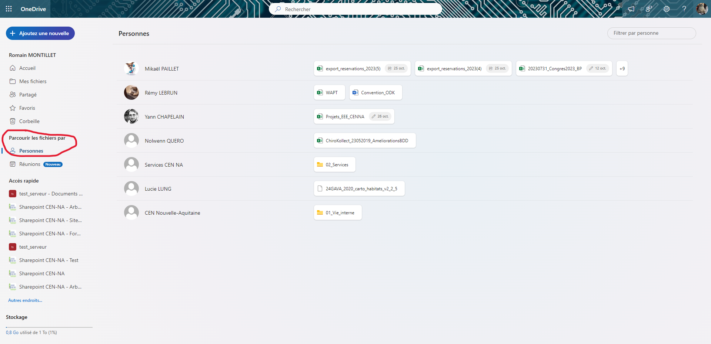

## Utiliser OneDrive et l’Assistant de Stockage pour économiser l'espace disque de votre PC

L’Assistant Stockage Windows est un outil qui fonctionne avec OneDrive pour libérer automatiquement de l’espace en rendant les fichiers locaux que vous n’utilisez plus en mode "hors ligne" sur le OneDrive en fichiers accessibles en ligne uniquement. Pour rappel: les fichiers en ligne uniquement sont stockés sur le OneDrive et sont accessibles aussi bien via votre naviguateur web que par l'explorateur de fichiers dès lors que vous disposez d'une connexion internet. 

Pour activer l'assistant de stockage, il vous faut :

1.Rechercher "Paramètres de stockage" dans le menu démarrer puis ouvrir l'application associée :

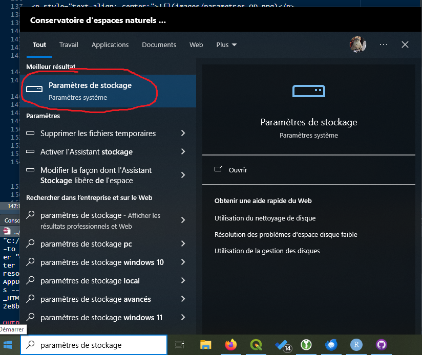

2. Activer l'assistant de stockage comme illustré ci-dessous puis sélectionnr "Configurer l'assistant de stockage"

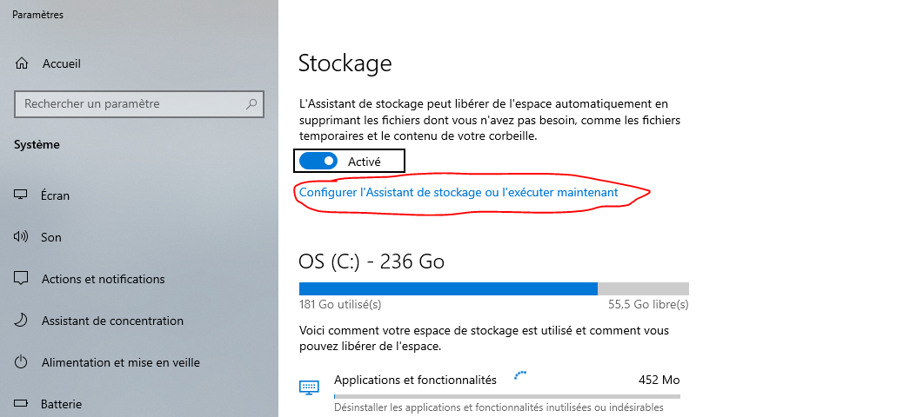

3. Descendre jusqu'à la partie intitulée "Contenu dans le cloud disponible en local" et changer les valeurs dans les listes déroulantes de "Jamais" à "14 jours" pour chacun des dossiers parents du OneDrive CEN-NA (00_Ressources / 01_Vie_Interne / etc.)

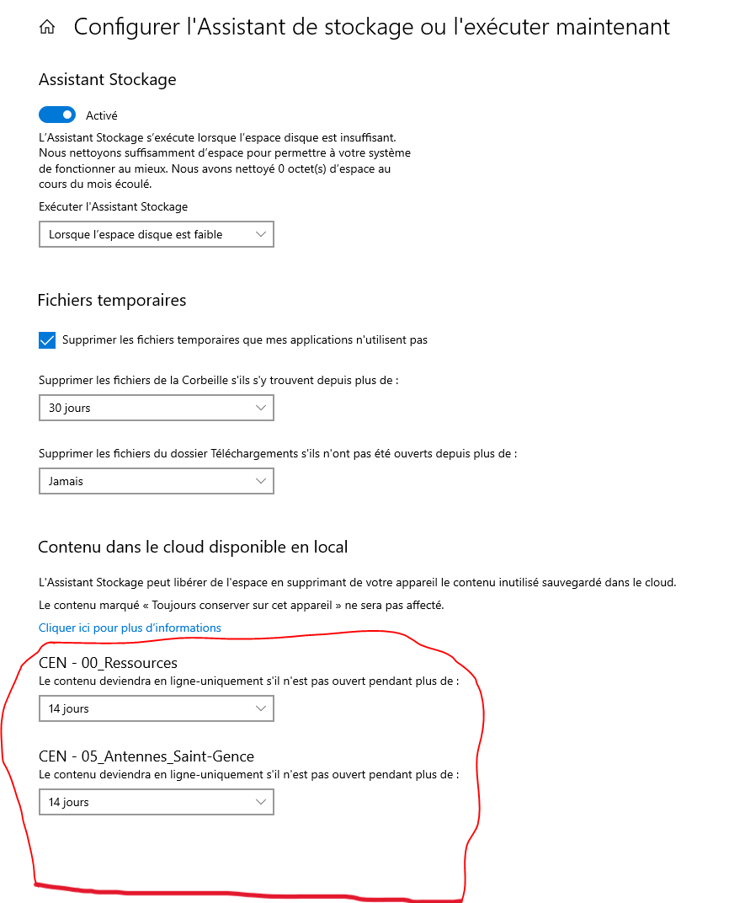

Toutes les deux semaines les fichiers que vous auriez pu rendre accessibles en mode "hors-connexion" basculeront automatiquement comme uniquement accessible en ligne depuis l'explorateur de fichiers (c'est à dire sous réserve d'une connexion internet). Toutes les deux semaines ce processus vous permettra ainsi de libérer votre disque dur d'un volume de stockage plus ou moins conséquent selon vos usages.

 

# **2. Gestion des modalités de partage d'un élément du OneDrive (dossier ou fichier) **

## Partage d'un élément :
### Avec toute l'équipe CEN-NA :
Sélectionnez le fichier ou le dossier à partager puis faites un clic-droit et choisissez "Partager".
La fenêtre de partage suivante apparait à l'écran:

Il vous suffit alors de vérifier le type d'autorisation sélectionné pour la génération du lien de partage (élément n°2 en rouge sur l'image). Si l'autorisation n'est pas définie sur "Les membres de votre organisation disposant du lien peuvent modifier le contenu", cliquez sur le type d'autorisation actuellement définie ou sur l'icone en forme de rouage (élément n°1 en rouge sur l'image) pour modifier cette option. Vous pourrez également à partir de là choisir si vous octroyez le droit de modifier l'élement à vos collaborateurs ou uniquement le droit de lecture ou de révision.
Une fois le lien de partage correctement paramétré il vous suffit de cliquer sur "Copier le lien" et de le communiquer aux personnes concernées.

<u>Remarque</u> : Merci de ne pas renseigner de message dans l'encart "Ajoutez un message" ni d'utiliser le bouton "Envoyer" étant donné que cette option n'est pas encore active dans notre M365.

### Uniquement avec un salarié ou un groupe de salariés spécifique

Pour partager un élément avec un, deux ou un groupe de salarié en particulier, la méthode reste la même que précedemment:
Il suffit de cliquer sur l'icone en forme de rouage puis de sélectionner "Partager le lien avec : Personne de votre choix" et d'appliquer ces changements.

Vous n'aurez plus qu'à renseigner le ou les noms des personnes avec qui vous souhaitez partager l'élément (ou le nom de tout un groupe de salariés : "Antenne 24", "CSE", "CODIR" etc.) dans l'encart :

### Avec des personnes extérieures au CEN-NA

Pour partager un élément avec des personnes extérieures au CEN-NA, la méthode est exactement la même que précedemment; il vous suffit simplement de renseigner les adresses mail des personnes dans l'encart :

Remarque: Contrairement au partage avec d'autres salariés du CEN-NA, il vous est possible de composer directement un message dans l'encart prévu à cet effet puis d'utiliser la fonctionnalité "Envoyer".

## Consultation des droits d'accès octroyés sur un élément et révocation des droits de partage 

<video width="700" height="395" controls>
  <source src="videos/revocation_droits.webm" type="video/mp4">
</video>

    
 

# **3. Divers**

## Cas des projets QGIS

"capture d'écran à intégrer ici"

## Bug : ouverture du OneDrive depuis Firefox est problématique

Certains collègues font face à des problèmes de connexion au OneDrive depuis une ou plusieurs versions de Firefox en particulier. 
Si vous rencontrez le message d'erreur ci-dessous merci de vous connecter au OneDrive depuis Google Chrome.

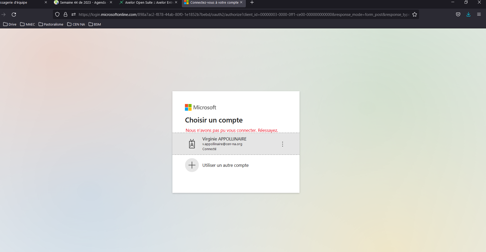

## Le OneDrive CEN-NA a disparu de mon explorateur de fichiers

Pas de panique, si le OneDrive CEN-NA a disparu de votre explorateur de fichiers cela est très certainement du au fait que votre OneDrive est déconnecté. Pour le relancer il vous suffit de taper dans la barre de recherche du menu démarrer le terme "OneDrive" et d'ouvrir l'application associée. Le OneDrive CEN-NA devrait alors réapparaître dans l'explorateur de fichiers 2 à 3 minutes après avoir relancé l'application.

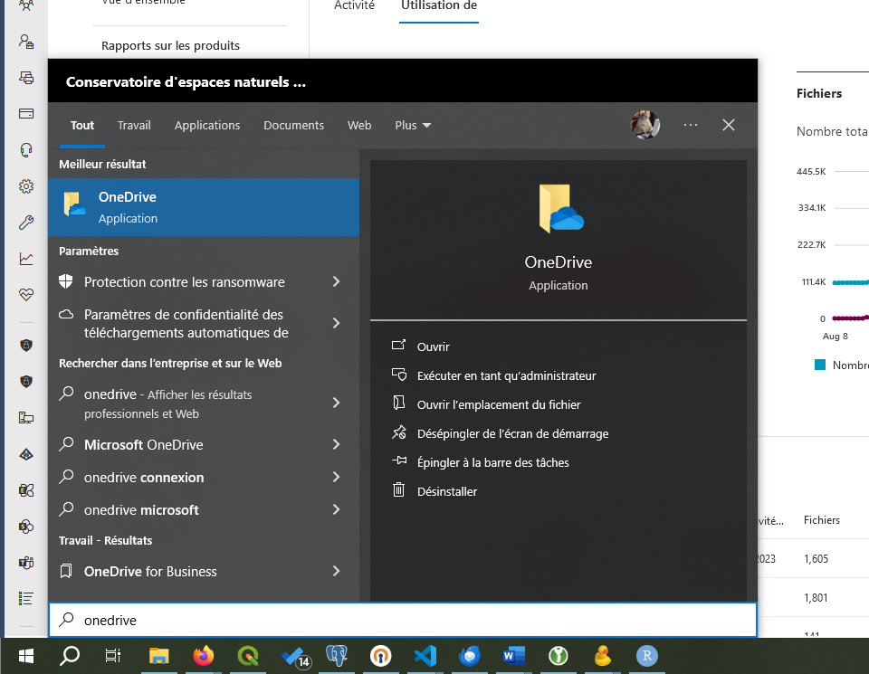

## Ma corbeille contient des dossiers dont les chemins correspondent à des emplacement du OneDrive CEN-NA

<!-- On vient de vérifier et c'est un comportement normal du OneDrive lorsque ce dernier est synchro dans l'explorateur de fichiers. Les dossiers supprimés depuis le OneDrive CEN-NA voient leurs "anciens emplacements" dans l'arborescence serveur transiter dans les corbeilles des salariés (ça n'occupe pas d'espace dans votre corbeille et sur votre PC) 🙂 -->

## ...

(liste à enrichir au fur et à mesure sur la base du retour des collègues)
------------------

